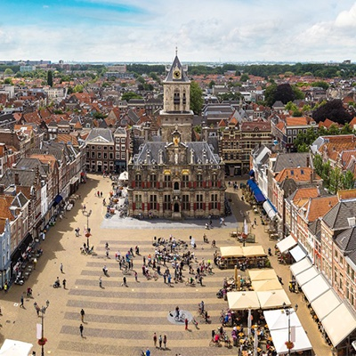
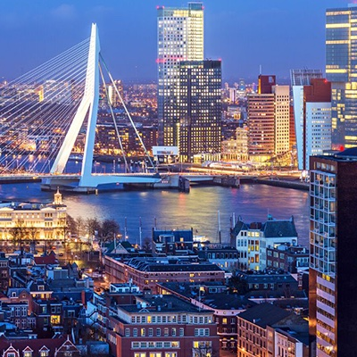
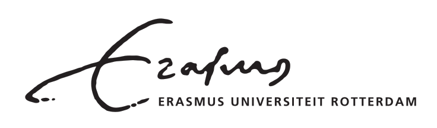

```{=html}
<div class="pf-hero">
  <div class="pf-hero-bg">
    <div class="pf-hero-bg-img" style="background-image:url('images/hero-delft.jpg');"></div>
    <div class="pf-hero-bg-img" style="background-image:url('images/hero-delft2.jpg');"></div>
    <div class="pf-hero-bg-img" style="background-image:url('images/hero-rotterdam.jpg');"></div>
    <div class="pf-hero-bg-img" style="background-image:url('images/hero-xian.jpg');"></div>
    <div class="pf-hero-bg-img" style="background-image:url('images/hero-guangzhou.jpg');"></div>
  </div>
  <div class="pf-hero-content">
    
    <p class="pf-hero-eyebrow">NWO &ndash; NSFC funded research</p>
    <h1 class="pf-hero-title">PAST-FORWARD</h1>
    <p class="pf-hero-subtitle">Preserving &amp; Adapting Spatial Transformations toward Future-Oriented Resilient Development</p>
  </div>
</div>

<div class="pf-stats">
  <div class="pf-stat">
    <p class="pf-stat-number">4</p>
    <p class="pf-stat-label">Living lab cities</p>
  </div>
  <div class="pf-stat">
    <p class="pf-stat-number">6</p>
    <p class="pf-stat-label">Partner institutions</p>
  </div>
  <div class="pf-stat">
    <p class="pf-stat-number">48</p>
    <p class="pf-stat-label">Month project</p>
  </div>
  <div class="pf-stat">
    <p class="pf-stat-number">2</p>
    <p class="pf-stat-label">Countries</p>
  </div>
</div>
```

::: {.pf-aim}
Rising temperatures and increased flooding are placing historic cities under growing pressure.

**PAST-FORWARD** develops strategies to help these Historic Urban Landscapes (HULs) adapt to climate change, while safeguarding their cultural heritage and the communities who inhabit them.

We're building adaptation strategies and open digital tools — from mapping climate risk to modelling design options — developed together with researchers, policymakers, and local communities in the Netherlands and China.

[Read more about the project &rarr;](about.qmd){.pf-readmore}
:::

```{=html}
<div class="pf-section-label">What we do</div>
<div class="pf-pillars">
  <div class="pf-pillar">
    <i class="pf-icon ti ti-shield-check"></i>
    <p class="pf-pillar-title">Resilience</p>
  </div>
  <div class="pf-pillar">
    <i class="pf-icon ti ti-building-castle"></i>
    <p class="pf-pillar-title">Heritage</p>
  </div>
  <div class="pf-pillar">
    <i class="pf-icon ti ti-device-laptop"></i>
    <p class="pf-pillar-title">Digital tools</p>
  </div>
  <div class="pf-pillar">
    <i class="pf-icon ti ti-scale"></i>
    <p class="pf-pillar-title">Equity</p>
  </div>
</div>

<div class="pf-section-label">Living labs</div>
<div class="pf-cities">
  <a class="pf-citylink" href="cities.qmd#delft"><span>Delft</span></a>
  <a class="pf-citylink" href="cities.qmd#rotterdam"><span>Rotterdam</span></a>
  <a class="pf-citylink" href="cities.qmd#xian"><span>Xi'an</span></a>
  <a class="pf-citylink" href="cities.qmd#guangzhou"><span>Guangzhou</span></a>
</div>
```

:::: pf-news
## Latest news

::: {#pf-news-listing}
:::
::::

## The Consortium
```{=html}
<div class="pf-partners">
  <a href="https://tudelft.nl"></a>
  <a href="https://scut.edu.cn"></a>
  <a href="https://eur.nl/esl"></a>
  <a href="https://xauat.edu.cn"></a>
  <a href="https://okra.nl"></a>
  <a href="https://www.gdupi.com"></a>
</div>
```
